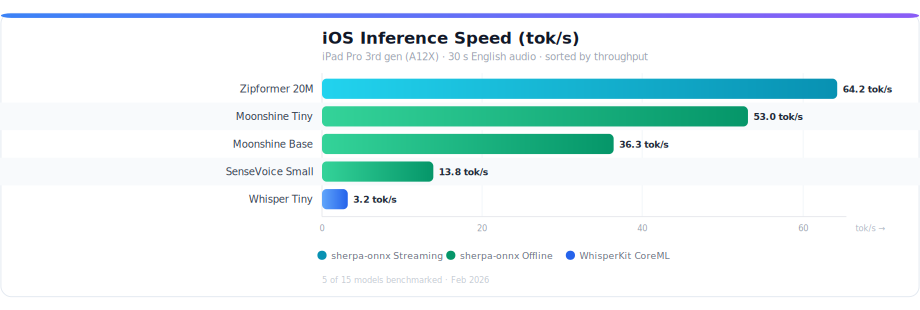
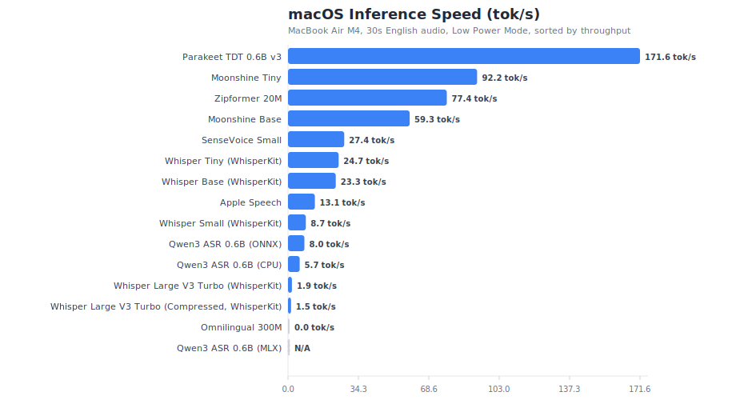
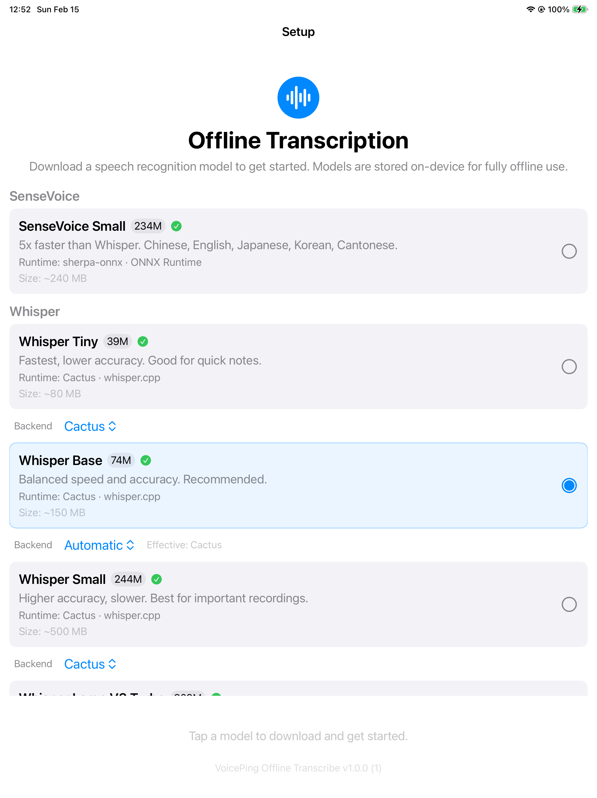
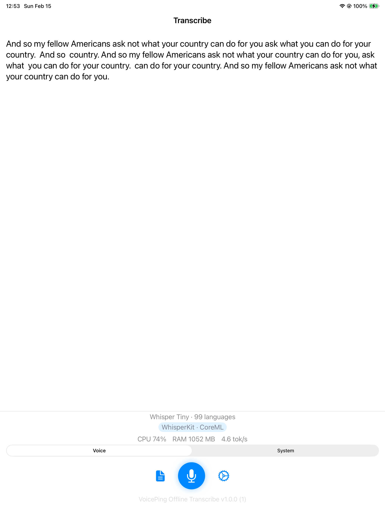
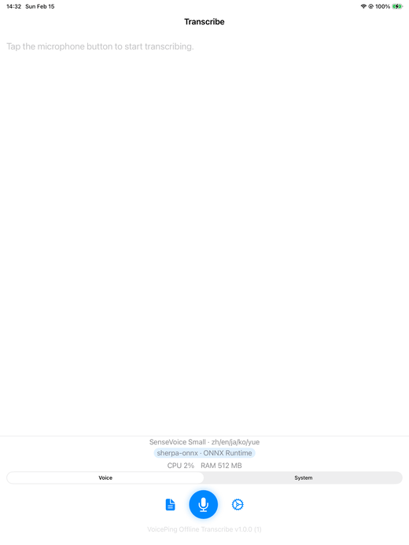
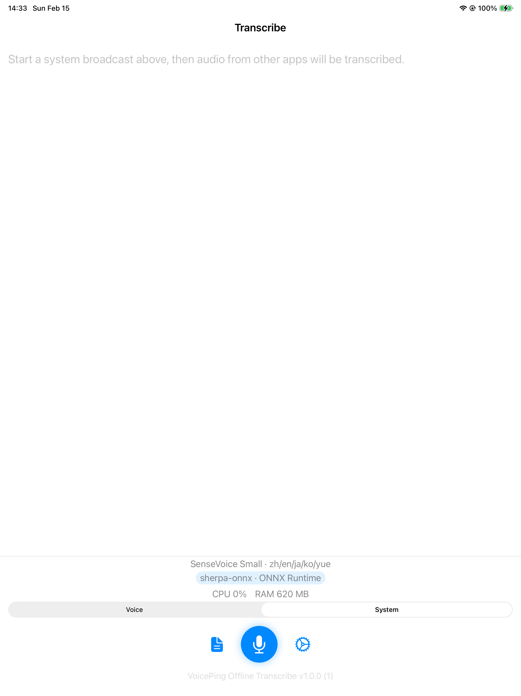

# iOS + macOS Offline Transcribe

[](https://github.com/voiceping-ai/ios-mac-offline-transcribe/actions/workflows/build.yml)

Offline-first iOS and macOS transcription app focused on local speech recognition.
All inference runs on-device after model download.

### Benchmark — iOS (iPad Pro 3rd gen, A12X)



### Benchmark — macOS (MacBook Air M4)



## Screenshots

### iOS (iPad Pro 3rd gen)

| Model Selection | Transcription Result |
|---|---|
|  |  |

**File Transcription Demo**



> SenseVoice Small transcribing a 30s audio file on iPad Pro 3rd gen (A12X), 23.6 tok/s. [Full video (MP4)](docs/screenshots/ios-file-transcription-demo.mp4).

### macOS (MacBook Air M4)

| Model Selection | Transcription Result |
|---|---|
|  |  |

**File Transcription Demo**


> SenseVoice Small transcribing a 30s audio file in ~2 seconds on MacBook Air M4. [Full video (MP4)](docs/screenshots/macos-file-transcription-demo.mp4).

### System Audio Capture (iOS)

The app can transcribe audio from other apps using Apple's ReplayKit Broadcast Upload Extension. Switch between **Voice** (microphone) and **System** (broadcast) modes via the segmented picker above the record button.



**How it works:**

1. User selects **System** mode and taps the record button.
2. iOS presents the system broadcast picker (RPSystemBroadcastPickerView).
3. The **Broadcast Upload Extension** (`BroadcastUploadExtension/SampleHandler.swift`) receives `.audioApp` sample buffers from ReplayKit — digital audio from other apps, not microphone input.
4. The extension converts audio to mono Float32 at 16 kHz and writes it to a **shared memory-mapped ring buffer** (~1.88 MB, 30 s capacity) in the App Group container.
5. The main app's **SystemAudioSource** polls the ring buffer via Darwin notifications + 50 ms timer, feeding samples to the active ASR engine for transcription.
6. Stopping: the app sets a `requestStop` flag in shared memory (checked every 200 ms by the extension) + sends a Darwin notification as backup.

> Requires a physical device — ReplayKit broadcast is not supported on the iOS Simulator.

**Implementation:**

```
┌─────────────────────────┐     ┌───────────────────────────────┐
│   Broadcast Extension   │     │          Main App             │
│   (separate process)    │     │                               │
│                         │     │  ┌─────────────────────────┐  │
│  ReplayKit .audioApp    │     │  │   SystemAudioSource      │  │
│  CMSampleBuffers        │     │  │   (ring buffer reader)   │  │
│         │               │     │  │         │                │  │
│         ▼               │     │  │         ▼                │  │
│  Convert to mono        │     │  │   WhisperService         │  │
│  Float32 @ 16 kHz       │     │  │   effectiveAudioSamples  │  │
│         │               │     │  │         │                │  │
│         ▼               │     │  │         ▼                │  │
│  ┌──────────────┐  ◄──Darwin──►  │   ASR Engine             │  │
│  │  Ring Buffer  │  notifications │   (any loaded model)    │  │
│  │  (mmap file)  │───────────►   │         │                │  │
│  └──────────────┘  shared mem │  │         ▼                │  │
│                         │     │  │   Transcription text     │  │
└─────────────────────────┘     │  └─────────────────────────┘  │
                                └───────────────────────────────┘
         App Group container: group.com.voiceping.transcribe
         Ring buffer file:    audio_ring.pcm (~1.88 MB)
```

| File | Role |
|---|---|
| `BroadcastUploadExtension/SampleHandler.swift` | `RPBroadcastSampleHandler` — receives system audio, resamples, writes to ring buffer |
| `Shared/SharedAudioRingBuffer.swift` | Lock-free single-producer/single-consumer mmap ring buffer (480k samples = 30 s) |
| `OfflineTranscription/Services/SystemAudioSource.swift` | Reader side — polls ring buffer, computes energy, feeds `onNewAudio` callback |
| `OfflineTranscription/Views/Components/BroadcastPickerView.swift` | `RPSystemBroadcastPickerView` UIViewRepresentable (hidden, triggered programmatically) |

The ring buffer header layout (20 bytes):

| Offset | Field | Description |
|---:|---|---|
| 0–3 | `writeOffset` | Producer write position (UInt32, atomic) |
| 4–7 | `readOffset` | Consumer read position (UInt32, atomic) |
| 8–11 | `sampleRate` | Always 16000 |
| 12–15 | `isActive` | 1 = broadcast running, 0 = stopped |
| 16–19 | `requestStop` | App sets to 1 to signal extension to stop |

Samples (Float32) start at byte 20. The extension 50 MB memory limit is respected by keeping the buffer small and doing minimal processing (no ASR in the extension).

## Current Scope (Code-Accurate)

- Live transcription with confirmed text plus rolling hypothesis.
- Audio source switching:
  - `Voice` (microphone)
  - `Device Audio` (speaker playback via measurement mode)
  - `System` (ReplayKit Broadcast Upload Extension + shared ring buffer)
- In-app model download/load/switch (15 models, 9 engines, multi-backend per Whisper and Qwen3 models).
- Runtime stats while recording (`CPU`, `RAM`, `tok/s`, elapsed audio).
- Recording controls and test-audio transcription (`test_speech.wav`).
- Session history with audio playback, waveform scrubber, and ZIP export.
- Settings toggles for `Voice Activity Detection` and `timestamps`.
- No cloud ASR dependency in runtime path.

Note: translation APIs exist in the service layer, but this repo build is transcription-focused and uses a no-op translation implementation.

## Supported Models

Defined in `OfflineTranscription/Models/ModelInfo.swift` and `OfflineTranscription/Resources/model-catalog.default.json`. 15 model cards across 8 families, with multiple inference backends per Whisper and Qwen3 model. Model ID links point to the **original model** from the research team; runtime distribution links are in the "Model Origins" table below.

### iOS Benchmark (iPad Pro 3rd gen, A12X Bionic)

4 GB RAM. Sorted by tok/s.

**Test audio**: 30-second WAV (16 kHz, mono, PCM 16-bit) of JFK's 1961 inaugural address, looped from an 11-second clip to reach the target duration.

**Metrics**:
- **tok/s** — output words per second of inference time (`total_words / elapsed_seconds`). Higher is faster.
- **RTF** — Real Time Factor (`inference_time / audio_duration`). Values below 1.0 mean faster than real-time.
- Inference time is wall-clock time for `engine.transcribe()` only — excludes model download and load.

| Model | Engine | Params | Model size (download) | Languages | tok/s | Status |
|---|---|---:|---:|---|---:|---|
| [`parakeet-tdt-v3`](https://huggingface.co/nvidia/parakeet-tdt-0.6b-v3) | FluidAudio (CoreML) | 600M | ~600 MB (CoreML) | 25 European | 181.8 | ✅ |
| [`zipformer-20m`](https://github.com/k2-fsa/icefall) | sherpa-onnx streaming | 20M | ~46 MB (INT8) | English | 39.7 | ✅ |
| [`whisper-tiny`](https://huggingface.co/openai/whisper-tiny) | whisper.cpp | 39M | ~31 MB (GGML Q5_1) | 99 languages | 37.8 | ✅ |
| [`moonshine-tiny`](https://huggingface.co/usefulsensors/moonshine-tiny) | sherpa-onnx offline | 27M | ~125 MB (INT8) | English | 37.3 | ✅ |
| [`moonshine-base`](https://huggingface.co/usefulsensors/moonshine-base) | sherpa-onnx offline | 61M | ~280 MB (INT8) | English | 31.3 | ✅ |
| [`whisper-base`](https://huggingface.co/openai/whisper-base) | WhisperKit (CoreML) | 74M | ~150 MB (CoreML) | English† | 19.6 | ❌ OOM on 4 GB‡ |
| [`sensevoice-small`](https://huggingface.co/FunAudioLLM/SenseVoiceSmall) | sherpa-onnx offline | 234M | ~240 MB (INT8) | zh/en/ja/ko/yue | 15.6 | ✅ |
| [`whisper-base`](https://huggingface.co/openai/whisper-base) | whisper.cpp | 74M | ~57 MB (GGML Q5_1) | 99 languages | 13.8 | ✅ |
| [`whisper-small`](https://huggingface.co/openai/whisper-small) | WhisperKit (CoreML) | 244M | ~500 MB (CoreML) | 99 languages | 6.3 | ❌ OOM on 4 GB‡ |
| [`qwen3-asr-0.6b`](https://huggingface.co/Qwen/Qwen3-ASR-0.8B) | Pure C (ARM NEON) | 600M | ~1.8 GB (safetensors) | 30 languages | 5.6 | ✅ |
| [`qwen3-asr-0.6b-onnx`](https://huggingface.co/Qwen/Qwen3-ASR-0.8B) | ONNX Runtime (INT8) | 600M | ~1.6 GB (INT8) | 30 languages | 5.4 | ✅ |
| [`whisper-tiny`](https://huggingface.co/openai/whisper-tiny) | WhisperKit (CoreML) | 39M | ~80 MB (CoreML) | 99 languages | 4.5 | ✅ |
| [`whisper-small`](https://huggingface.co/openai/whisper-small) | whisper.cpp | 244M | ~181 MB (GGML Q5_1) | 99 languages | 3.9 | ✅ |
| [`whisper-large-v3-turbo-compressed`](https://huggingface.co/openai/whisper-large-v3-turbo) | WhisperKit (CoreML) | 809M | ~1 GB (CoreML) | 99 languages | 1.9 | ❌ OOM on 4 GB‡ |
| [`whisper-large-v3-turbo`](https://huggingface.co/openai/whisper-large-v3-turbo) | WhisperKit (CoreML) | 809M | ~600 MB (CoreML) | 99 languages | 1.4 | ❌ OOM on 4 GB‡ |
| [`whisper-large-v3-turbo`](https://huggingface.co/openai/whisper-large-v3-turbo) | whisper.cpp | 809M | ~547 MB (GGML Q5_0) | 99 languages | 0.8 | ⚠️ RTF >1 |
| [`whisper-large-v3-turbo-compressed`](https://huggingface.co/openai/whisper-large-v3-turbo) | whisper.cpp | 809M | ~834 MB (GGML Q8_0) | 99 languages | 0.8 | ⚠️ RTF >1 |

> † whisper-base (WhisperKit) uses `.en` English-only variant due to multilingual CoreML conversion issues.
> ‡ WhisperKit E2E FAIL on 4 GB iPad — CoreML compilation OOM. Timing is from cached (pre-compiled) CoreML runs; first run adds 30-120s compilation.

### macOS Benchmark (MacBook Air M4)

32 GB RAM. Low Power Mode on during benchmark. Same 30-second JFK test audio as above. Sorted by tok/s.

| Model | Engine | Params | Model size (download) | Languages | tok/s | Status |
|---|---|---:|---:|---|---:|---|
| [`parakeet-tdt-v3`](https://huggingface.co/nvidia/parakeet-tdt-0.6b-v3) | FluidAudio (CoreML) | 600M | ~600 MB (CoreML) | 25 European | 171.6 | ✅ |
| [`moonshine-tiny`](https://huggingface.co/usefulsensors/moonshine-tiny) | sherpa-onnx offline | 27M | ~125 MB (INT8) | English | 92.2 | ✅ |
| [`zipformer-20m`](https://github.com/k2-fsa/icefall) | sherpa-onnx streaming | 20M | ~46 MB (INT8) | English | 77.4 | ✅ |
| [`moonshine-base`](https://huggingface.co/usefulsensors/moonshine-base) | sherpa-onnx offline | 61M | ~280 MB (INT8) | English | 59.3 | ✅ |
| [`sensevoice-small`](https://huggingface.co/FunAudioLLM/SenseVoiceSmall) | sherpa-onnx offline | 234M | ~240 MB (INT8) | zh/en/ja/ko/yue | 27.4 | ✅ |
| [`whisper-tiny`](https://huggingface.co/openai/whisper-tiny) | WhisperKit (CoreML) | 39M | ~80 MB (CoreML) | 99 languages | 24.7 | ✅ |
| [`whisper-base`](https://huggingface.co/openai/whisper-base) | WhisperKit (CoreML) | 74M | ~150 MB (CoreML) | English† | 23.3 | ✅ |
| [`apple-speech`](https://developer.apple.com/documentation/speech/sfspeechrecognizer) | SFSpeechRecognizer | System | Built-in (0 MB download) | 50+ languages | 13.1 | ✅ |
| [`whisper-small`](https://huggingface.co/openai/whisper-small) | WhisperKit (CoreML) | 244M | ~500 MB (CoreML) | 99 languages | 8.7 | ✅ |
| [`qwen3-asr-0.6b-onnx`](https://huggingface.co/Qwen/Qwen3-ASR-0.8B) | ONNX Runtime (INT8) | 600M | ~1.6 GB (INT8) | 30 languages | 8.0 | ✅ |
| [`qwen3-asr-0.6b`](https://huggingface.co/Qwen/Qwen3-ASR-0.8B) | Pure C (ARM NEON) | 600M | ~1.8 GB (safetensors) | 30 languages | 5.7 | ✅ |
| [`whisper-large-v3-turbo`](https://huggingface.co/openai/whisper-large-v3-turbo) | WhisperKit (CoreML) | 809M | ~600 MB (CoreML) | 99 languages | 1.9 | ✅ |
| [`whisper-large-v3-turbo-compressed`](https://huggingface.co/openai/whisper-large-v3-turbo) | WhisperKit (CoreML) | 809M | ~1 GB (CoreML) | 99 languages | 1.5 | ✅ |
| [`qwen3-asr-0.6b-mlx`](https://huggingface.co/Qwen/Qwen3-ASR-0.8B) | MLX (Metal GPU) | 600M | ~400 MB (4-bit) | 30 languages | — | 🆕 Not benchmarked |
| [`omnilingual-300m`](https://huggingface.co/facebook/mms-1b-all) | sherpa-onnx offline | 300M | ~365 MB (INT8) | 1,600+ languages | 0.03 | ❌ English broken |

> † whisper-base (WhisperKit) uses `.en` English-only variant due to multilingual CoreML conversion issues.

> **Want to see a new model benchmarked?** If there is an offline ASR model you would like added or benchmarked on a specific device, please [open an issue](https://github.com/voiceping-ai/ios-mac-offline-transcribe/issues/new) with the model name and target hardware. Community contributions of benchmark results on different devices are also welcome.

### Model Origins

Original models vs runtime distribution formats used by each engine.

| Model Family | Original Author | License | Runtime Distribution |
|---|---|---|---|
| Whisper | [OpenAI](https://huggingface.co/openai/whisper-large-v3-turbo) | MIT | [WhisperKit CoreML](https://huggingface.co/argmaxinc/whisperkit-coreml) · [whisper.cpp GGML](https://huggingface.co/ggerganov/whisper.cpp) |
| Moonshine | [Useful Sensors](https://huggingface.co/usefulsensors/moonshine-base) | MIT | [sherpa-onnx INT8](https://huggingface.co/csukuangfj/sherpa-onnx-moonshine-base-en-int8) |
| SenseVoice | [Alibaba FunAudioLLM](https://huggingface.co/FunAudioLLM/SenseVoiceSmall) | Apache 2.0 | [sherpa-onnx INT8](https://huggingface.co/csukuangfj/sherpa-onnx-sense-voice-zh-en-ja-ko-yue-2024-07-17) |
| Zipformer | [k2-fsa / icefall](https://github.com/k2-fsa/icefall) | Apache 2.0 | [sherpa-onnx](https://huggingface.co/csukuangfj/sherpa-onnx-streaming-zipformer-en-20M-2023-02-17) |
| Omnilingual | [Facebook MMS](https://huggingface.co/facebook/mms-1b-all) | CC-BY-NC 4.0 | [sherpa-onnx INT8](https://huggingface.co/csukuangfj2/sherpa-onnx-omnilingual-asr-1600-languages-300M-ctc-int8-2025-11-12) |
| Parakeet TDT 0.6B v3 | [NVIDIA NeMo](https://huggingface.co/nvidia/parakeet-tdt-0.6b-v3) | CC-BY 4.0 | FluidAudio CoreML · [FluidInference/parakeet-tdt-0.6b-v3-coreml](https://huggingface.co/FluidInference/parakeet-tdt-0.6b-v3-coreml) |
| Qwen3 ASR | [Alibaba Qwen](https://huggingface.co/Qwen/Qwen3-ASR-0.8B) | Apache 2.0 | [antirez/qwen-asr](https://github.com/antirez/qwen-asr) (Pure C) · ONNX INT8 · [MLX 4-bit](https://huggingface.co/mlx-community/Qwen3-ASR-0.6B-4bit) |
| Apple Speech | [Apple](https://developer.apple.com/documentation/speech) | System built-in | On-device (no download) |

Download URL sources (code-accurate):
- whisper.cpp: `OfflineTranscription/Resources/model-catalog.default.json` contains exact Hugging Face `resolve/main/*` artifact URLs + `sha256` checksums.
- sherpa-onnx + Qwen (Pure C/ONNX): `OfflineTranscription/Services/ModelDownloader.swift` constructs Hugging Face `resolve/main/*` URLs (default org: `csukuangfj`).
- WhisperKit: `WhisperKit.download(... from: "argmaxinc/whisperkit-coreml")`.
- FluidAudio: `AsrModels.downloadAndLoad(version: .v3)` downloads from Hugging Face `FluidInference/*` repos (see FluidAudio docs).

whisper.cpp uses GGML quantized models (Q5_0/Q5_1/Q8_0) with no CoreML compilation step — instant model load, 100% reliable on all devices. WhisperKit uses ANE/GPU acceleration and is faster for larger models once CoreML is cached, but requires 30-120s first-run compilation and fails on memory-constrained devices. Full benchmark data in `artifacts/benchmarks/`.

`parakeet-tdt-v3` is filtered at runtime when device capability checks fail.

## Architecture

- Orchestrator: `OfflineTranscription/Services/WhisperService.swift` + `TranscriptionCoordinator.swift` (inference loop, VAD, chunking)
- Engines (9 total):
  - `CactusEngine` — Whisper family via [whisper.cpp](https://github.com/ggml-org/whisper.cpp) (CPU + Metal GPU, GGML quantized)
  - `WhisperKitEngine` — Whisper family via [WhisperKit](https://github.com/argmaxinc/WhisperKit) CoreML (ANE + GPU)
  - `SherpaOnnxOfflineEngine` — Moonshine, SenseVoice, Omnilingual via [sherpa-onnx](https://github.com/k2-fsa/sherpa-onnx) ONNX Runtime
  - `SherpaOnnxStreamingEngine` — Zipformer via [sherpa-onnx](https://github.com/k2-fsa/sherpa-onnx) ONNX Runtime (100 ms chunks)
  - `FluidAudioEngine` — Parakeet TDT v3 via [FluidAudio](https://github.com/FluidInference/FluidAudio) CoreML
  - `AppleSpeechEngine` — Built-in [SFSpeechRecognizer](https://developer.apple.com/documentation/speech/sfspeechrecognizer)
  - `QwenASREngine` — [Qwen3 ASR 0.6B](https://huggingface.co/Qwen/Qwen3-ASR-0.8B) via [antirez/qwen-asr](https://github.com/antirez/qwen-asr) pure C (ARM NEON, 6 threads)
  - `QwenOnnxEngine` — [Qwen3 ASR 0.6B INT8](https://huggingface.co/jima/qwen3-asr-0.6b-onnx-int8) via ONNX Runtime
  - `MLXEngine` — [Qwen3 ASR 0.6B 4-bit](https://huggingface.co/mlx-community/Qwen3-ASR-0.6B-4bit) via [MLX](https://github.com/ml-explore/mlx-swift) Metal GPU (macOS Apple Silicon only)
- Supporting services: `ModelCatalogService`, `ModelDownloader`, `EngineFactory`, `BackendResolver`, `SystemMetrics`
- Backend selection: `BackendResolver` with automatic fallback (iOS: whisper.cpp → legacy; macOS: mlx → legacy)
- Audio capture: `OfflineTranscription/Services/AudioRecorder.swift`
- System capture:
  - `BroadcastUploadExtension/SampleHandler.swift` (ReplayKit)
  - `OfflineTranscription/Services/SystemAudioSource.swift` (shared ring buffer IPC)
- History/export: SwiftData (`TranscriptionRecord`) + `SessionFileManager` + `ZIPExporter`
- UI: `OfflineTranscription/Views/TranscriptionView.swift`, `OfflineTranscription/Views/ModelSetupView.swift`

## Requirements

- macOS
- Xcode 15+
- iOS 17+
- `xcodegen`

## Setup

```bash
git clone <repo-url>
cd ios-mac-offline-transcribe
scripts/setup-ios-deps.sh
scripts/generate-ios-project.sh
open VoicePingIOSOfflineTranscribe.xcodeproj
```

For local signing overrides:

```bash
cp project.local.yml.example project.local.yml
scripts/generate-ios-project.sh
```

## Build

```bash
xcodebuild -project VoicePingIOSOfflineTranscribe.xcodeproj \
  -scheme OfflineTranscription \
  -destination 'generic/platform=iOS' build
```

## macOS App

This repo includes a native macOS target: `OfflineTranscriptionMac`.

### Setup (macOS)

```bash
scripts/setup-ios-deps.sh
scripts/setup-macos-deps.sh
scripts/generate-ios-project.sh
```

### Build + Install (macOS)

`--auto-test` is only compiled in `Debug` builds (used for benchmarking).

```bash
xcodebuild -project VoicePingIOSOfflineTranscribe.xcodeproj \
  -scheme OfflineTranscriptionMac \
  -configuration Debug \
  -derivedDataPath build/DerivedDataMac \
  -destination 'platform=macOS,name=My Mac,arch=arm64' \
  -allowProvisioningUpdates \
  build

rm -rf /Applications/OfflineTranscriptionMac-local.app
ditto build/DerivedDataMac/Build/Products/Debug/OfflineTranscriptionMac.app \
  /Applications/OfflineTranscriptionMac-local.app
```

### Run (macOS)

```bash
open -n -a /Applications/OfflineTranscriptionMac-local.app

# Auto-test a single model (writes an E2E JSON result file)
open -n -a /Applications/OfflineTranscriptionMac-local.app --args \
  --auto-test --model-id qwen3-asr-0.6b-onnx
```

### Model Caching (macOS)

Models are cached locally and persist across app reinstalls.

- sherpa-onnx + Qwen bundles (App Group container):
  - `~/Library/Group Containers/*group.com.voiceping.transcribe*/SherpaModels`
- WhisperKit (Hugging Face Hub) models:
  - `~/Library/Containers/<bundle-id>/Data/Documents/huggingface/models`

If the UI keeps showing **Downloading model...** on every launch, it's usually because the model directory is missing/corrupt, or you are running an older build that cached into a different location.

### Benchmark (macOS)

- E2E result JSON output:
  - `~/Library/Containers/<bundle-id>/Data/tmp/e2e_result_<model_id>.json`
  - (when not sandboxed, it may also write to `/tmp/e2e_result_<model_id>.json`)

Run a per-model E2E sweep:

```bash
EVAL_WAV_PATH=artifacts/benchmarks/long_en_eval.wav \
  scripts/macos-e2e-test.sh --app /Applications/OfflineTranscriptionMac-local.app
```

Latest benchmark table (macOS, 30s fixture): `artifacts/benchmarks/macos-benchmark-2026-02-14.md`.

## Tests and Automation

```bash
scripts/ci-ios-unit-test.sh
scripts/ios-e2e-test.sh
scripts/ios-ui-flow-tests.sh
```

## Privacy & Network Usage

All audio recording and transcription run locally on device. The app makes **no analytics, telemetry, or crash-reporting calls**. Network is used only for model downloads, listed below:

| Connection | Destination | When | Data Sent |
|---|---|---|---|
| sherpa-onnx model download | `huggingface.co/csukuangfj/*` | User selects a Moonshine, SenseVoice, Whisper (sherpa), Zipformer, or Omnilingual model | None (HTTPS GET only) |
| WhisperKit model download | `huggingface.co/argmaxinc/whisperkit-coreml` | User selects a Whisper model (WhisperKit backend) | None (HTTPS GET only) |
| whisper.cpp model download | `huggingface.co/ggerganov/whisper.cpp` | User selects a Whisper model (whisper.cpp backend) | None (HTTPS GET only) |
| FluidAudio model download | `huggingface.co/FluidInference/*` | User selects Parakeet TDT v3 | None (HTTPS GET only) |
| Qwen3 ASR download (CPU/ONNX) | `huggingface.co/Qwen/*`, `huggingface.co/jima/*` | User selects Qwen3 ASR (CPU or ONNX) | None (HTTPS GET only) |
| Qwen3 ASR download (MLX) | `huggingface.co/mlx-community/*` | User selects Qwen3 ASR MLX backend (macOS) | None (HTTPS GET only) |
| Apple Speech | System built-in | User selects Apple Speech model | None — `requiresOnDeviceRecognition = true` |

All model downloads are user-initiated (on model selection), cached locally, and never re-downloaded once present. No user audio, transcription text, or usage data leaves the device.

## License

Apache License 2.0. See `LICENSE`.
